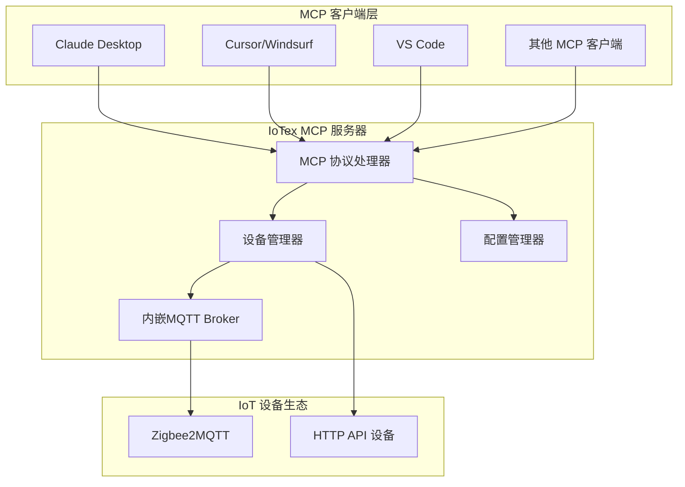

# IoTex

> 基于 Model Context Protocol (MCP) 的硬件设备连接工具

通过标准化 MCP 协议为 AI 应用提供 IoT 设备访问和控制能力，实现自然语言与物理设备的交互。

**使用场景说明**：本项目仅推荐用于小型部署场景，或个人试验使用。

[](https://github.com/UE-DND/iotex/actions/workflows/ci.yml)
[](https://opensource.org/licenses/MIT)
[](https://nodejs.org/)
[](https://modelcontextprotocol.io/)
[](https://www.npmjs.com/package/iotex-mcp)

## 快速开始

### 安装

全局安装：

```bash
npm install -g iotex-mcp
```

使用 npx 运行（无需安装）：

```bash
npx iotex-mcp
```

### 配置

配置文件 `iotex-config.yaml`（可选）：

```yaml
server:
  name: iotex-mcp
  mqtt:
    mode: embedded # 使用内嵌MQTT Broker（默认）
    # mode: external  # 或连接外部Broker
    # mode: cloud     # 或使用公共云端服务器

adapters:
  # Zigbee2MQTT（需要Zigbee USB协调器和Zigbee2MQTT软件）
  zigbee2mqtt:
    enabled: true
    base_topic: 'zigbee2mqtt'
    # MQTT连接会自动使用内嵌Broker，无需配置mqtt_broker

  # HTTP API 设备（通过 REST API 控制的设备）
  http:
    enabled: true
    # 设备配置在 devices 部分定义
```

**内嵌MQTT Broker说明**：

- **自动启动**：IoTex启动时自动运行内置MQTT Broker
- **自动连接**：Zigbee2MQTT等适配器自动连接内嵌Broker
- **本地通信**：数据在本地处理
- **端口管理**：自动选择可用端口，避免冲突

**如果已有MQTT Broker**：

```yaml
server:
  mqtt:
    mode: external
    broker: 'mqtt://localhost:1883'
    username: 'your_username' # 可选
    password: '${MQTT_PASSWORD}' # 可选
```

**设备配置**：

当前版本需要手动配置设备（自动发现功能规划中）：

```yaml
devices:
  light-001:
    protocol: mqtt # mqtt 或 http
    friendly_name: '客厅主灯'
    location: '客厅'
    type: 'smart_light'
    capabilities: ['power', 'brightness', 'color_temp']
    # 可选：安全配置
    # security:
    #   level: 'medium'
    #   requires_confirmation: true
```

> **注意**：自动设备发现和交互式注册功能正在开发中，当前版本需要手动配置设备。

### 客户端配置

客户端配置示例：

```json
{
	"mcpServers": {
		"iotex": {
			"command": "npx",
			"args": ["-y", "iotex-mcp"],
			"env": {
				"IOTEX_CONFIG": "./iotex-config.yaml"
			}
		}
	}
}
```

## 系统架构



## 支持的通信协议

| 协议                 | 适配器                 | 状态      | 说明          |
| -------------------- | ---------------------- | --------- | ------------- |
| **MQTT/Zigbee2MQTT** | `mqtt` / `zigbee2mqtt` | ✅ 已实现 | Zigbee 设备   |
| **HTTP API**         | `http`                 | ✅ 已实现 | REST API 设备 |

## 开发

### 环境要求

- Node.js >= 22.0.0
- npm >= 10.0.0

### 构建项目

```bash
cd mcp
npm install
npm run build
```

### 运行开发模式

```bash
npm run dev
```

### 代码检查

```bash
npm run lint
npm run format
```

## 贡献

可通过 Issue 和 Pull Request 参与项目贡献。

## 许可证

[MIT License](./LICENSE)
