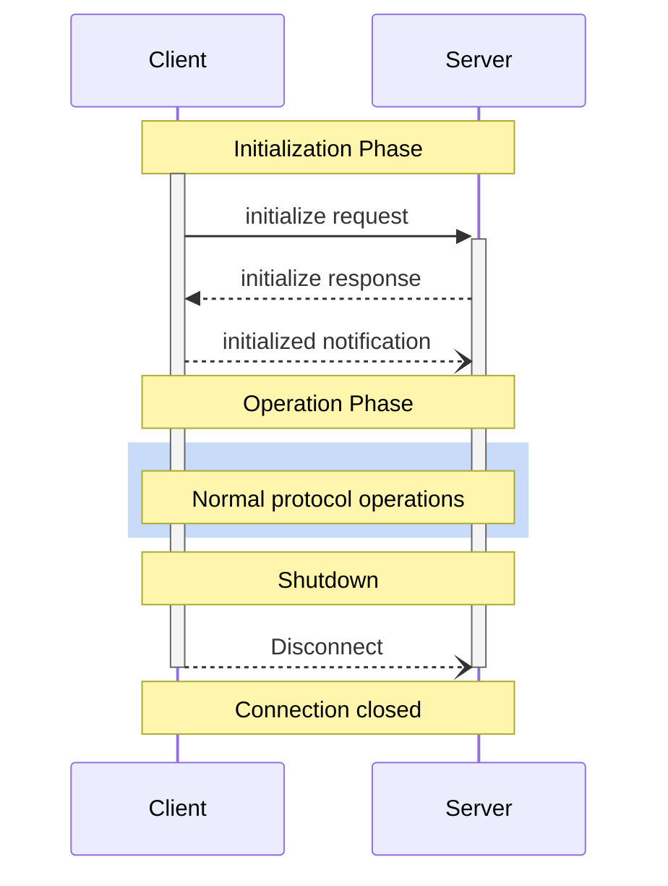

<div id="enable-section-numbers" />

<Info>**协议版本**: 2025-06-18</Info>

模型上下文协议(MCP)为客户端-服务器
连接定义了严格的生命周期，以确保适当的能力协商和状态管理。

1. **初始化**: 能力协商和协议版本协议
2. **操作**: 正常协议通信
3. **关闭**: 优雅终止连接



## 生命周期阶段

### 初始化

初始化阶段**必须**是客户端和服务器之间的第一次交互。
在此阶段，客户端和服务器：

- 建立协议版本兼容性
- 交换和协商能力
- 共享实现细节

客户端**必须**通过发送包含以下内容的`initialize`请求来启动此阶段：

- 支持的协议版本
- 客户端能力
- 客户端实现信息

```json
{
  "jsonrpc": "2.0",
  "id": 1,
  "method": "initialize",
  "params": {
    "protocolVersion": "2024-11-05",
    "capabilities": {
      "roots": {
        "listChanged": true
      },
      "sampling": {},
      "elicitation": {}
    },
    "clientInfo": {
      "name": "ExampleClient",
      "title": "Example Client Display Name",
      "version": "1.0.0"
    }
  }
}
```

服务器**必须**以其自身的能力和信息进行响应：

```json
{
  "jsonrpc": "2.0",
  "id": 1,
  "result": {
    "protocolVersion": "2024-11-05",
    "capabilities": {
      "logging": {},
      "prompts": {
        "listChanged": true
      },
      "resources": {
        "subscribe": true,
        "listChanged": true
      },
      "tools": {
        "listChanged": true
      }
    },
    "serverInfo": {
      "name": "ExampleServer",
      "title": "Example Server Display Name",
      "version": "1.0.0"
    },
    "instructions": "Optional instructions for the client"
  }
}
```

成功初始化后，客户端**必须**发送`initialized`通知
以表明它已准备好开始正常操作：

```json
{
  "jsonrpc": "2.0",
  "method": "notifications/initialized"
}
```

- 客户端**不应该**在服务器响应`initialize`请求之前发送除
  [pings](/specification/2025-06-18/basic/utilities/ping)以外的请求。
- 服务器**不应该**在接收到`initialized`通知之前发送除
  [pings](/specification/2025-06-18/basic/utilities/ping)和
  [logging](/specification/2025-06-18/server/utilities/logging)以外的请求。

#### 版本协商

在`initialize`请求中，客户端**必须**发送它支持的协议版本。
这**应该**是客户端支持的_最新_版本。

如果服务器支持请求的协议版本，它**必须**以相同的
版本响应。否则，服务器**必须**以它
支持的另一个协议版本响应。这**应该**是服务器支持的_最新_版本。

如果客户端不支持服务器响应中的版本，它**应该**
断开连接。

<Note>
如果使用HTTP，客户端**必须**在后续所有对MCP
服务器的请求中包含`MCP-Protocol-Version:
<protocol-version>`HTTP头。
有关详细信息，请参见[传输中的协议版本头部分](/specification/2025-06-18/basic/transports#protocol-version-header)。
</Note>

#### 能力协商

客户端和服务器能力确定在会话期间将
可用的可选协议功能。

关键能力包括：

| 类别 | 能力 | 描述 |
| -------- | -------------- | ----------------------------------------------------------------------------------------- |
| 客户端   | `roots`        | 提供文件系统[根路径](/specification/2025-06-18/client/roots)的能力             |
| 客户端   | `sampling`     | 支持LLM[采样](/specification/2025-06-18/client/sampling)请求            |
| 客户端   | `elicitation`  | 支持服务器[引导](/specification/2025-06-18/client/elicitation)请求   |
| 客户端   | `experimental` | 描述对非标准实验性功能的支持                                  |
| 服务器   | `prompts`      | 提供[提示模板](/specification/2025-06-18/server/prompts)                       |
| 服务器   | `resources`    | 提供可读的[资源](/specification/2025-06-18/server/resources)                 |
| 服务器   | `tools`        | 暴露可调用的[工具](/specification/2025-06-18/server/tools)                          |
| 服务器   | `logging`      | 发出结构化的[日志消息](/specification/2025-06-18/server/utilities/logging)       |
| 服务器   | `completions`  | 支持参数[自动补全](/specification/2025-06-18/server/utilities/completion) |
| 服务器   | `experimental` | 描述对非标准实验性功能的支持                                  |

能力对象可以描述子能力，如：

- `listChanged`：支持列表更改通知（用于提示、资源和
  工具）
- `subscribe`：支持订阅单个项目的更改（仅限资源）

### 操作

在操作阶段，客户端和服务器根据
协商的能力交换消息。

双方**必须**：

- 遵守协商的协议版本
- 仅使用成功协商的能力

### 关闭

在关闭阶段，一方（通常是客户端）清洁地终止协议
连接。没有定义特定的关闭消息——相反，应该使用底层传输
机制来发送连接终止信号：

#### stdio

对于stdio[传输](/specification/2025-06-18/basic/transports)，客户端**应该**通过以下方式启动
关闭：

1. 首先，关闭到子进程（服务器）的输入流
2. 等待服务器退出，或如果服务器在合理时间内未退出则发送`SIGTERM`
3. 如果服务器在`SIGTERM`后在合理时间内未退出，则发送`SIGKILL`

服务器**可以**通过关闭其到客户端的输出流并
退出来启动关闭。

#### HTTP

对于HTTP[传输](/specification/2025-06-18/basic/transports)，关闭由关闭
相关的HTTP连接指示。

## 超时

实现**应该**为所有发送的请求建立超时，以防止连接挂起
和资源耗尽。当请求在超时期内没有收到成功或错误
响应时，发送者**应该**为该请求发出[取消
通知](/specification/2025-06-18/basic/utilities/cancellation)并停止等待
响应。

SDK和其他中间件**应该**允许这些超时在每个请求的
基础上进行配置。

实现**可以**选择在接收到与请求相对应的[进度
通知](/specification/2025-06-18/basic/utilities/progress)时重置超时时钟，因为这
意味着实际上正在进行工作。然而，实现**应该**总是
执行最大超时，无论进度通知如何，以限制行为不端的
客户端或服务器的影响。

## 错误处理

实现**应该**准备好处理这些错误情况：

- 协议版本不匹配
- 无法协商所需的能力
- 请求[超时](#超时)

初始化错误示例：

```json
{
  "jsonrpc": "2.0",
  "id": 1,
  "error": {
    "code": -32602,
    "message": "Unsupported protocol version",
    "data": {
      "supported": ["2024-11-05"],
      "requested": "1.0.0"
    }
  }
}
```
