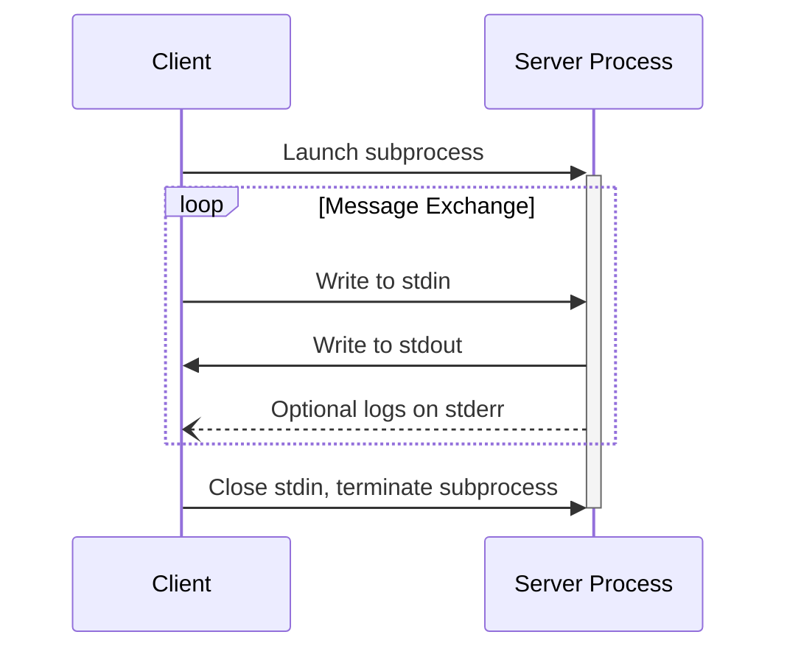
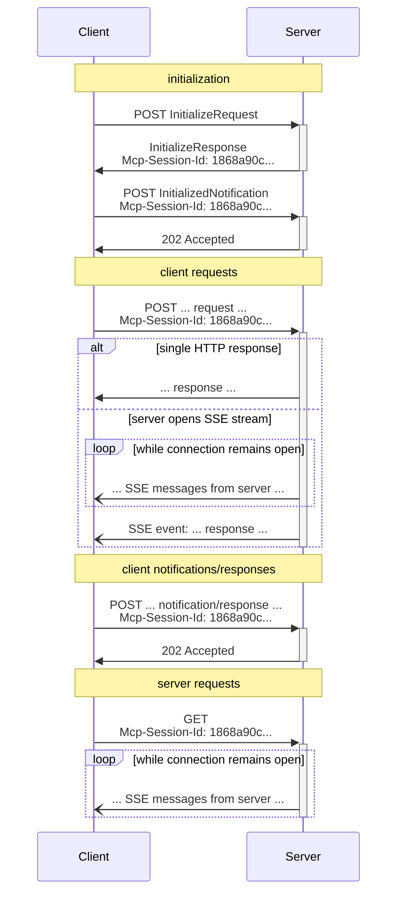

<Info>**协议版本**: 2025-06-18</Info>

MCP使用JSON-RPC编码消息。JSON-RPC消息**必须**使用UTF-8编码。

协议目前为客户端-服务器
通信定义了两种标准传输机制：

1. [stdio](#stdio)，通过标准输入和标准输出进行通信
2. [流式HTTP](#streamable-http)

客户端**应该**尽可能支持stdio。

客户端和服务器也可以以可插拔的方式实现
[自定义传输](#custom-transports)。

## stdio

在**stdio**传输中：

- 客户端将MCP服务器作为子进程启动。
- 服务器从其标准输入（`stdin`）读取JSON-RPC消息，并将消息发送
  到其标准输出（`stdout`）。
- 消息是单个JSON-RPC请求、通知或响应。
- 消息由换行符分隔，并且**禁止**包含嵌入的换行符。
- 服务器**可以**出于日志记录目的向其标准错误（`stderr`）写入UTF-8字符串。
  客户端**可以**捕获、转发或忽略此日志记录。
- 服务器**禁止**向其`stdout`写入任何不是有效MCP消息的内容。
- 客户端**禁止**向服务器的`stdin`写入任何不是有效MCP消息的内容。

## 流式HTTP

<Info>

这取代了协议版本2024-11-05中的[HTTP+SSE
传输](/specification/2024-11-05/basic/transports#http-with-sse)。请参见下面的[向后兼容性](#backwards-compatibility)
指南。

</Info>

在**流式HTTP**传输中，服务器作为一个独立进程运行，
可以处理多个客户端连接。此传输使用HTTP POST和GET请求。
服务器可以选择性地使用
[服务器发送事件](https://en.wikipedia.org/wiki/Server-sent_events) (SSE)来流式传输
多个服务器消息。这允许基本MCP服务器，以及支持流式传输和服务器到客户端通知和请求的更丰富功能的服务器。

服务器**必须**提供一个单一的HTTP端点路径（以下称为
**MCP端点**），该端点支持POST和GET方法。例如，这可以是一个
像`https://example.com/mcp`这样的URL。

#### 安全警告

在实现流式HTTP传输时：

1. 服务器**必须**验证所有入站连接的`Origin`头，以防止DNS重绑定攻击
2. 在本地运行时，服务器**应该**仅绑定到localhost (127.0.0.1)而不是所有网络接口 (0.0.0.0)
3. 服务器**应该**为所有连接实现适当的身份验证

没有这些保护措施，攻击者可能使用DNS重绑定从远程网站与本地MCP服务器交互。

### Sending Messages to the Server

Every JSON-RPC message sent from the client **MUST** be a new HTTP POST request to the
MCP endpoint.

1. The client **MUST** use HTTP POST to send JSON-RPC messages to the MCP endpoint.
2. The client **MUST** include an `Accept` header, listing both `application/json` and
   `text/event-stream` as supported content types.
3. The body of the POST request **MUST** be a single JSON-RPC _request_, _notification_, or _response_.
4. If the input is a JSON-RPC _response_ or _notification_:
   - If the server accepts the input, the server **MUST** return HTTP status code 202
     Accepted with no body.
   - If the server cannot accept the input, it **MUST** return an HTTP error status code
     (e.g., 400 Bad Request). The HTTP response body **MAY** comprise a JSON-RPC _error
     response_ that has no `id`.
5. If the input is a JSON-RPC _request_, the server **MUST** either
   return `Content-Type: text/event-stream`, to initiate an SSE stream, or
   `Content-Type: application/json`, to return one JSON object. The client **MUST**
   support both these cases.
6. If the server initiates an SSE stream:
   - The SSE stream **SHOULD** eventually include JSON-RPC _response_ for the
     JSON-RPC _request_ sent in the POST body.
   - The server **MAY** send JSON-RPC _requests_ and _notifications_ before sending the
     JSON-RPC _response_. These messages **SHOULD** relate to the originating client
     _request_.
   - The server **SHOULD NOT** close the SSE stream before sending the JSON-RPC _response_
     for the received JSON-RPC _request_, unless the [session](#session-management)
     expires.
   - After the JSON-RPC _response_ has been sent, the server **SHOULD** close the SSE
     stream.
   - Disconnection **MAY** occur at any time (e.g., due to network conditions).
     Therefore:
     - Disconnection **SHOULD NOT** be interpreted as the client cancelling its request.
     - To cancel, the client **SHOULD** explicitly send an MCP `CancelledNotification`.
     - To avoid message loss due to disconnection, the server **MAY** make the stream
       [resumable](#resumability-and-redelivery).

### Listening for Messages from the Server

1. The client **MAY** issue an HTTP GET to the MCP endpoint. This can be used to open an
   SSE stream, allowing the server to communicate to the client, without the client first
   sending data via HTTP POST.
2. The client **MUST** include an `Accept` header, listing `text/event-stream` as a
   supported content type.
3. The server **MUST** either return `Content-Type: text/event-stream` in response to
   this HTTP GET, or else return HTTP 405 Method Not Allowed, indicating that the server
   does not offer an SSE stream at this endpoint.
4. If the server initiates an SSE stream:
   - The server **MAY** send JSON-RPC _requests_ and _notifications_ on the stream.
   - These messages **SHOULD** be unrelated to any concurrently-running JSON-RPC
     _request_ from the client.
   - The server **MUST NOT** send a JSON-RPC _response_ on the stream **unless**
     [resuming](#resumability-and-redelivery) a stream associated with a previous client
     request.
   - The server **MAY** close the SSE stream at any time.
   - The client **MAY** close the SSE stream at any time.

### Multiple Connections

1. The client **MAY** remain connected to multiple SSE streams simultaneously.
2. The server **MUST** send each of its JSON-RPC messages on only one of the connected
   streams; that is, it **MUST NOT** broadcast the same message across multiple streams.
   - The risk of message loss **MAY** be mitigated by making the stream
     [resumable](#resumability-and-redelivery).

### Resumability and Redelivery

To support resuming broken connections, and redelivering messages that might otherwise be
lost:

1. Servers **MAY** attach an `id` field to their SSE events, as described in the
   [SSE standard](https://html.spec.whatwg.org/multipage/server-sent-events.html#event-stream-interpretation).
   - If present, the ID **MUST** be globally unique across all streams within that
     [session](#session-management)—or all streams with that specific client, if session
     management is not in use.
2. If the client wishes to resume after a broken connection, it **SHOULD** issue an HTTP
   GET to the MCP endpoint, and include the
   [`Last-Event-ID`](https://html.spec.whatwg.org/multipage/server-sent-events.html#the-last-event-id-header)
   header to indicate the last event ID it received.
   - The server **MAY** use this header to replay messages that would have been sent
     after the last event ID, _on the stream that was disconnected_, and to resume the
     stream from that point.
   - The server **MUST NOT** replay messages that would have been delivered on a
     different stream.

In other words, these event IDs should be assigned by servers on a _per-stream_ basis, to
act as a cursor within that particular stream.

### Session Management

An MCP "session" consists of logically related interactions between a client and a
server, beginning with the [initialization phase](/specification/2025-06-18/basic/lifecycle). To support
servers which want to establish stateful sessions:

1. A server using the Streamable HTTP transport **MAY** assign a session ID at
   initialization time, by including it in an `Mcp-Session-Id` header on the HTTP
   response containing the `InitializeResult`.
   - The session ID **SHOULD** be globally unique and cryptographically secure (e.g., a
     securely generated UUID, a JWT, or a cryptographic hash).
   - The session ID **MUST** only contain visible ASCII characters (ranging from 0x21 to
     0x7E).
2. If an `Mcp-Session-Id` is returned by the server during initialization, clients using
   the Streamable HTTP transport **MUST** include it in the `Mcp-Session-Id` header on
   all of their subsequent HTTP requests.
   - Servers that require a session ID **SHOULD** respond to requests without an
     `Mcp-Session-Id` header (other than initialization) with HTTP 400 Bad Request.
3. The server **MAY** terminate the session at any time, after which it **MUST** respond
   to requests containing that session ID with HTTP 404 Not Found.
4. When a client receives HTTP 404 in response to a request containing an
   `Mcp-Session-Id`, it **MUST** start a new session by sending a new `InitializeRequest`
   without a session ID attached.
5. Clients that no longer need a particular session (e.g., because the user is leaving
   the client application) **SHOULD** send an HTTP DELETE to the MCP endpoint with the
   `Mcp-Session-Id` header, to explicitly terminate the session.
   - The server **MAY** respond to this request with HTTP 405 Method Not Allowed,
     indicating that the server does not allow clients to terminate sessions.

### Sequence Diagram

### Protocol Version Header

If using HTTP, the client **MUST** include the `MCP-Protocol-Version:
<protocol-version>` HTTP header on all subsequent requests to the MCP
server, allowing the MCP server to respond based on the MCP protocol version.

For example: `MCP-Protocol-Version: 2025-06-18`

The protocol version sent by the client **SHOULD** be the one [negotiated during
initialization](/specification/2025-06-18/basic/lifecycle#version-negotiation).

For backwards compatibility, if the server does _not_ receive an `MCP-Protocol-Version`
header, and has no other way to identify the version - for example, by relying on the
protocol version negotiated during initialization - the server **SHOULD** assume protocol
version `2025-03-26`.

If the server receives a request with an invalid or unsupported
`MCP-Protocol-Version`, it **MUST** respond with `400 Bad Request`.

### Backwards Compatibility

Clients and servers can maintain backwards compatibility with the deprecated [HTTP+SSE
transport](/specification/2024-11-05/basic/transports#http-with-sse) (from
protocol version 2024-11-05) as follows:

**Servers** wanting to support older clients should:

- Continue to host both the SSE and POST endpoints of the old transport, alongside the
  new "MCP endpoint" defined for the Streamable HTTP transport.
  - It is also possible to combine the old POST endpoint and the new MCP endpoint, but
    this may introduce unneeded complexity.

**Clients** wanting to support older servers should:

1. Accept an MCP server URL from the user, which may point to either a server using the
   old transport or the new transport.
2. Attempt to POST an `InitializeRequest` to the server URL, with an `Accept` header as
   defined above:
   - If it succeeds, the client can assume this is a server supporting the new Streamable
     HTTP transport.
   - If it fails with an HTTP 4xx status code (e.g., 405 Method Not Allowed or 404 Not
     Found):
     - Issue a GET request to the server URL, expecting that this will open an SSE stream
       and return an `endpoint` event as the first event.
     - When the `endpoint` event arrives, the client can assume this is a server running
       the old HTTP+SSE transport, and should use that transport for all subsequent
       communication.

## Custom Transports

Clients and servers **MAY** implement additional custom transport mechanisms to suit
their specific needs. The protocol is transport-agnostic and can be implemented over any
communication channel that supports bidirectional message exchange.

Implementers who choose to support custom transports **MUST** ensure they preserve the
JSON-RPC message format and lifecycle requirements defined by MCP. Custom transports
**SHOULD** document their specific connection establishment and message exchange patterns
to aid interoperability.
