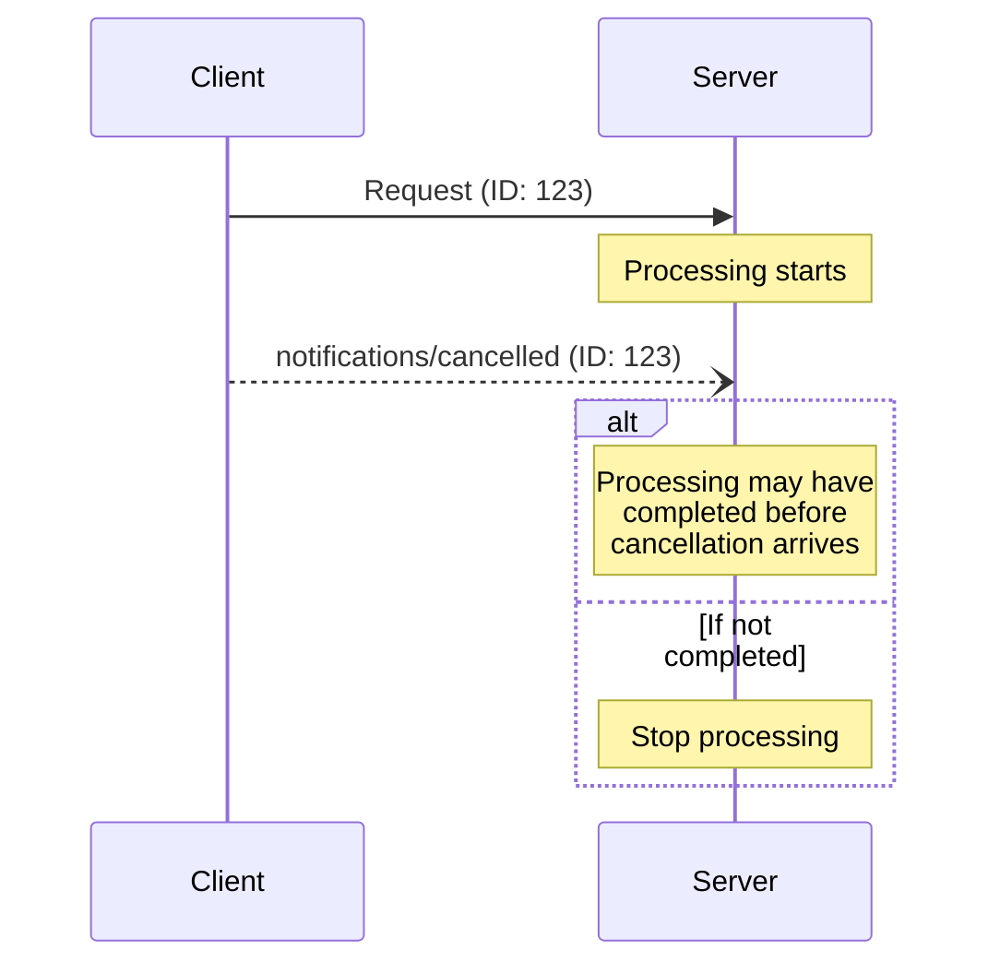

<div id="enable-section-numbers" />

<Info>**协议版本**: 2025-06-18</Info>

模型上下文协议(MCP)通过通知消息支持可选的进行中请求取消功能。
任一方都可以发送取消通知来表示之前发出的请求应该被终止。

## 取消流程

当一方想要取消进行中的请求时，它发送一个`notifications/cancelled`
通知，包含：

- 要取消的请求ID
- 可记录或显示的可选原因字符串

```json
{
  "jsonrpc": "2.0",
  "method": "notifications/cancelled",
  "params": {
    "requestId": "123",
    "reason": "User requested cancellation"
  }
}
```

## 行为要求

1. 取消通知**必须**仅引用以下请求：
   - 之前在同一方向发出的
   - 被认为仍在进行中的
2. 客户端**禁止**取消`initialize`请求
3. 取消通知的接收者**应该**：
   - 停止处理被取消的请求
   - 释放相关资源
   - 不为被取消的请求发送响应
4. 接收者**可以**在以下情况下忽略取消通知：
   - 引用的请求未知
   - 处理已经完成
   - 请求无法被取消
5. 取消通知的发送者**应该**忽略随后到达的
   该请求的任何响应

## 时序考虑

由于网络延迟，取消通知可能在请求处理
完成后到达，并且可能在响应已经发送后到达。

双方**必须**优雅地处理这些竞争条件：



## 实现说明

- 双方**应该**记录取消原因以便调试
- 应用程序UI**应该**在请求取消时给出指示

## 错误处理

无效的取消通知**应该**被忽略：

- 未知的请求ID
- 已完成的请求
- 格式错误的通知

这保持了通知的"即发即弃"特性，同时允许异步通信中的竞争
条件。
