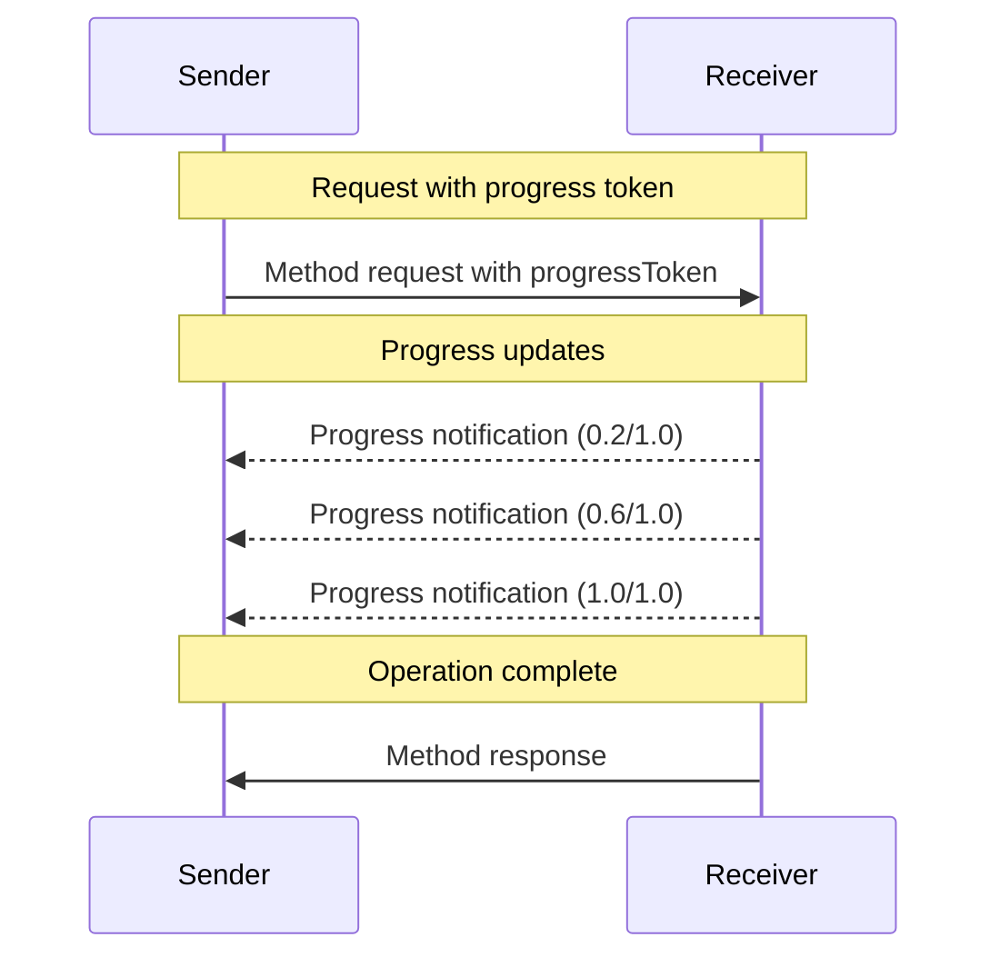

<div id="enable-section-numbers" />

<Info>**协议版本**: 2025-06-18</Info>

模型上下文协议(MCP)通过通知消息支持对长时间运行
操作的可选进度跟踪。任一方都可以发送进度通知来
提供操作状态的更新。

## 进度流程

当一方想要_接收_请求的进度更新时，它在请求元数据中包含一个
`progressToken`。

- 进度令牌**必须**是字符串或整数值
- 进度令牌可以由发送者使用任何手段选择，但**必须**在
  所有活跃请求中唯一。

```json
{
  "jsonrpc": "2.0",
  "id": 1,
  "method": "some_method",
  "params": {
    "_meta": {
      "progressToken": "abc123"
    }
  }
}
```

接收者然后**可以**发送包含以下内容的进度通知：

- 原始进度令牌
- 目前的进度值
- 可选的“总计”值
- 可选的“消息”值

```json
{
  "jsonrpc": "2.0",
  "method": "notifications/progress",
  "params": {
    "progressToken": "abc123",
    "progress": 50,
    "total": 100,
    "message": "Reticulating splines..."
  }
}
```

- `progress`值**必须**随每个通知递增，即使总数
  未知。
- `progress`和`total`值**可以**是浮点数。
- `message`字段**应该**提供相关的人类可读进度信息。

## 行为要求

1. 进度通知**必须**仅引用以下令牌：
   - 在活跃请求中提供的
   - 与进行中操作相关联的

2. 进度请求的接收者**可以**：
   - 选择不发送任何进度通知
   - 以他们认为适当的任何频率发送通知
   - 如果未知，则省略总数值



## 实现说明

- 发送者和接收者**应该**跟踪活跃的进度令牌
- 双方**应该**实现速率限制以防止洪水攻击
- 进度通知**必须**在完成后停止
